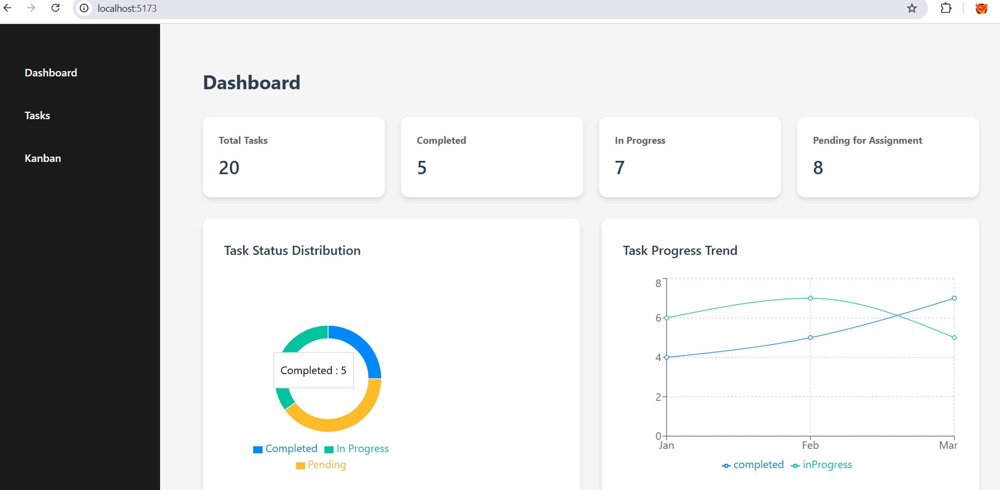
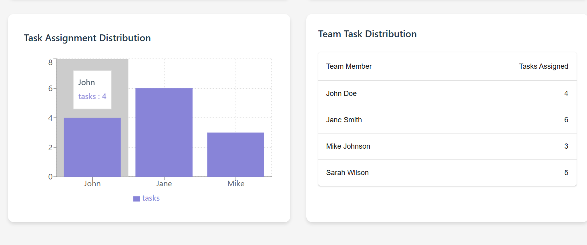
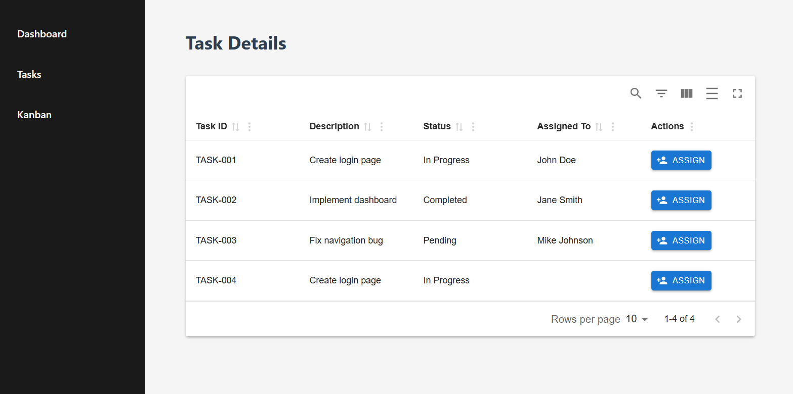

# Task Management Application

A React-based task management system built with TypeScript and Vite.

## Features

- Interactive Dashboard with real-time statistics
- Task Management with assignable tasks
- Kanban Board with drag-and-drop functionality
- Team performance tracking and visualization
- Responsive design for various screen sizes

## Tech Stack

- React 18
- TypeScript
- Vite
- Material-UI
- React Router DOM
- Material React Table
- Recharts for data visualization
- React Beautiful DND for drag-and-drop
- Atlaskit components

## Getting Started

1. Clone the repository
```sh
git clone [repository-url]
cd task-management

npm install
npm run dev

The application will be available at http://localhost:5173
Available Scripts
npm run dev - Starts the development server
npm run build - Builds the app for production
npm run preview - Preview the production build
npm run lint - Run ESLint for code quality
```


